# Injury Severity Prediction During Accidents Using ML Techniques

- **Prepared for:** UMBC Data Science Master Degree Capstone by Dr. Chaojie (Jay) Wang
- **Author Name:** Rohith Kotar
- **GitHub Profile:** [Rohith Kotar](https://github.com/KotarRohith)
- **LinkedIn Profile:** [Rohith Kotar](https://www.linkedin.com/in/rohith-kotar/)
- **Link to PowerPoint Presentation:** [PPT](https://github.com/rohithkotar/UMBC-DATA606-Capstone/blob/main/docs/Rohith_Kotar_606.pptx)
- **Link to YouTube Video:** [Youtube](https://youtu.be/HyAdlI_3urA)

## Background

### Objective
This project aims to develop a robust predictive modeling approach for estimating injury severity in accidents for an unbalanced dataset using Machine Learning

### Significance
- Accurate prediction of injury severity can lead to more efficient resource allocation in emergency response systems, potentially saving lives by ensuring timely and appropriate medical attention.
- Improved injury severity prediction can aid in the development of proactive measures for accident prevention, contributing to overall public safety and reducing the occurrence of severe accidents.
- Reliable injury severity prediction models can facilitate the development of personalized treatment plans for accident victims, optimizing healthcare resources and improving patient outcomes.
- The insights gained from this research can have broader implications beyond accident-related injuries, potentially informing predictive modeling efforts in other domains with imbalanced datasets, such as healthcare and finance.

### Research Questions
1. How can we effectively address class imbalance in the dataset during the process of injury severity prediction?
2. Which machine learning algorithms demonstrate superior performance in predicting injury severity within unbalanced datasets?
3. Are there any trade-offs between model performance and computational efficiency when using sampling versus non-sampling approaches?

### Additional Considerations
- Various sampling methods, including oversampling and undersampling techniques, explored to mitigate class imbalance within the dataset.
- Comparative analysis will be conducted by training predictive models both with and without sampling methods to discern their impact on predictive accuracy.

## Data

- **Data sources:** [Montgomery County Crash Reporting Drivers Data](https://data.montgomerycountymd.gov/Public-Safety/Crash-Reporting-Drivers-Data/mmzv-x632/about_data) (Click on Export to download the CSV file)
- **Data size:** 104MB
- **Data shape:** (172105, 51)
- **Target/label:** injury_severity
    - NO APPARENT INJURY: 141185
    - POSSIBLE INJURY: 17482
    - SUSPECTED MINOR INJURY: 11870
    - SUSPECTED SERIOUS INJURY: 1415
    - FATAL INJURY: 153

### Columns in the Dataset
| Column Name                  | Description                                                    | Type         |
|------------------------------|----------------------------------------------------------------|--------------|
| ACRS Report Type             | Identifies crash as property, injury, or fatal.                | Plain Text   |
| Crash Date/Time              | Date and Time of crash.                                        | Date & Time  |
| Route Type                   | Type of roadway at crash location.                             | Plain Text   |
| Cross-Street Type            | Roadway type for nearest cross-street.                         | Plain Text   |
| Collision Type               | Type of collision.                                             | Plain Text   |
| Surface Condition            | Condition of roadway surface.                                  | Plain Text   |
| Light                        | Lighting conditions.                                           | Plain Text   |
| Traffic Control              | Signage or traffic control devices.                            | Plain Text   |
| Driver Substance Abuse       | Substance abuse detected for all drivers involved.             | Plain Text   |
| Injury Severity              | Severity of injury to this driver.                             | Plain Text   |
| Circumstance                 | Circumstance(s) specific to this driver.                       | Plain Text   |
| Vehicle Damage Extent        | The severity of the vehicle damage.                            | Plain Text   |
| Vehicle Body Type            | The body type of the vehicle.                                  | Plain Text   |
| Vehicle Movement             | The movement of the vehicle at the time of the collision.      | Plain Text   |
| Speed Limit                  | Vehicle Circumstances - Local area posted speed limit.         | Number       |
| Driverless Vehicle           | Vehicle Circumstances - If the vehicle was driverless or not.  | Plain Text   |
| Vehicle Year                 | Vehicle - The vehicle's year.                                  | Number       |
| Vehicle Make                 | Vehicle - Make of the Vehicle                                  | Plain Text   |
| Latitude                     | Y coordinate of crash location.                                | Number       |
| Longitude                    | X coordinate of crash location.                                | Number       |

## Exploratory Data Analysis (EDA)

- Dataset is imbalanced.
- Missing values are imputed.
- Features are transformed.
- Feature extraction is done creating new columns for accurate prediction of target.
- Columns are encoded with One hot Encoding and Ordinal Encoding and then scaled using standard scalar.
## Visualizations

#### Distribution of accidents

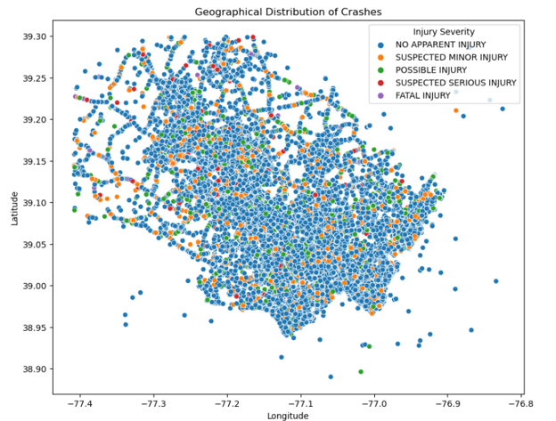

#### Distribution of Collision Types
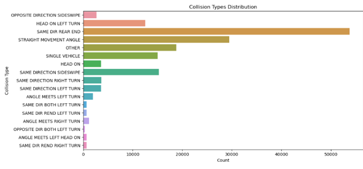

#### Crashes over time
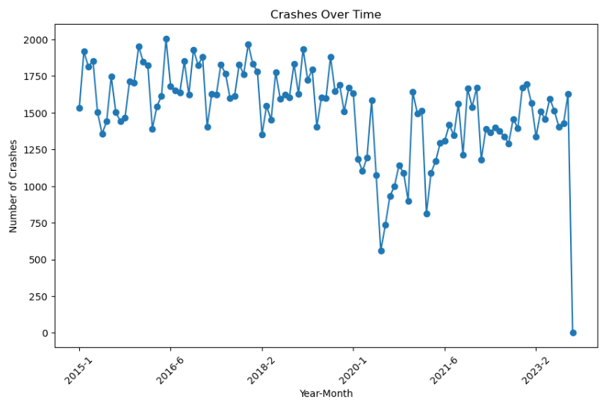

#### Feature importance
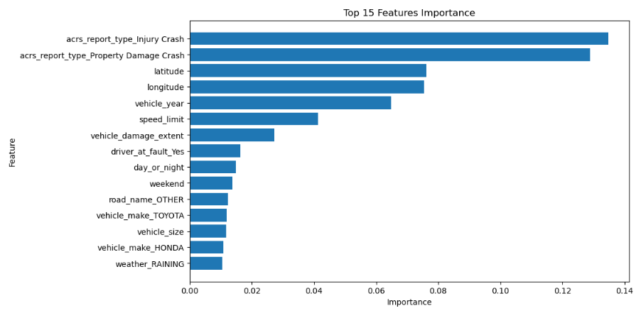

## Model Training

### Predictive Analytics Models
- Logistic Regression
- Decision Tree
- Random Forest
- Gradient Boosting
- Ensemble Models (combination of above algorithms)
    - Each model is tuned using hyperparameter optimization techniques such as GridSearchCV.

#### Logistic Regression
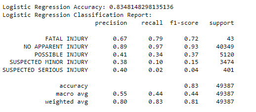
#### Random Forest
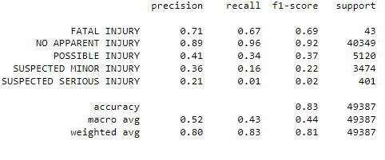
#### Gradient Boosting
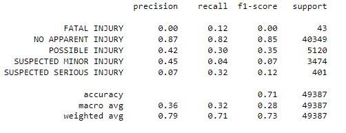
#### Decision Tree
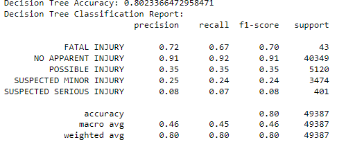
#### RF with Grid Search CV
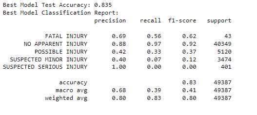
#### SMOTE
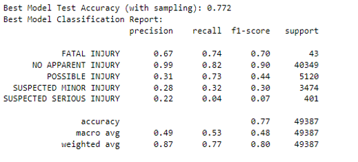

### Train vs Test Split
- The dataset was split into training and testing sets using an 80:20 ratio, ensuring a sufficient amount of data for model training and evaluation.

### Performance Measurement
- Model performance will be assessed using the following metrics:
    - Precision
    - Recall
    - F1-Score
  Out of all model Decision Tree performed better.

### Stream lit
- Created Stream Lit application to take user input and predict the injury severity. User input is passed through same preprocessing pipeline which was used to train the model.
- This application was deployed into streamlit cloud and can be accessed using below link.
  (if below link is not working it can be run using final.py file. streamlit run final.py)

https://czuoqygrbvyevqjg9xflec.streamlit.app/

  
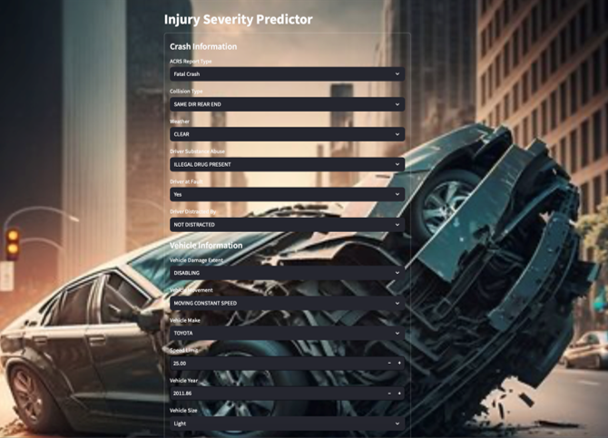
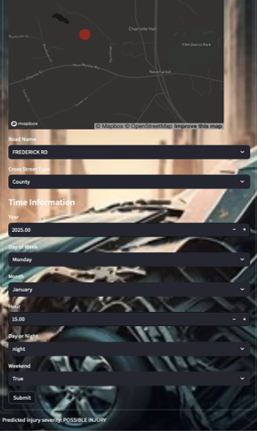

## Conclusion:
- The research developed a robust predictive modeling approach for estimating injury severity in accidents using Machine Learning techniques.
- The study found that Decision Tree performed better than other algorithms, with good F1-score and Accuracy.
- Feature engineering techniques significantly improved model performance.
- The predictive model can aid in efficient resource allocation in emergency response systems, potentially saving lives.
- The model can contribute to the development of personalized treatment plans for accident victims, optimizing healthcare resources.
- Investigate additional feature engineering techniques to further improve model performance.

If you have any problem loading python files on GitHub paste the link in [https://nbviewer.org/](https://nbviewer.org/) to view the ipynb file.

## References

- [Grid Search in scikit-learn](https://scikit-learn.org/stable/modules/grid_search.html)
- [Hyperparameter Tuning the Random Forest in Python using scikit-learn](https://towardsdatascience.com/hyperparameter-tuning-the-random-forest-in-python-using-scikit-learn-28d2aa77dd74)
- [Feature Engineering](https://www.youtube.com/playlist?list=PLKnIA16_RmvYXWH_E6PuVLLHHTWXwwDN7)
- 602 Project ( Introduction to Machine Learning).
- Feature Engineering for Machine Learning: Strategies for Data Preprocessing by Kuhn, M., and Johnson, K. (2019)
- "Injury Severity Prediction: A Review of Literature and Methods" by Abdel-Wahab, O. M., et al. (2009). This paper provides a comprehensive overview of injury severity prediction methods.
- SMOTE Analysis - https://medium.com/@corymaklin/synthetic-minority-over-sampling-technique-smote-7d419696b88c
